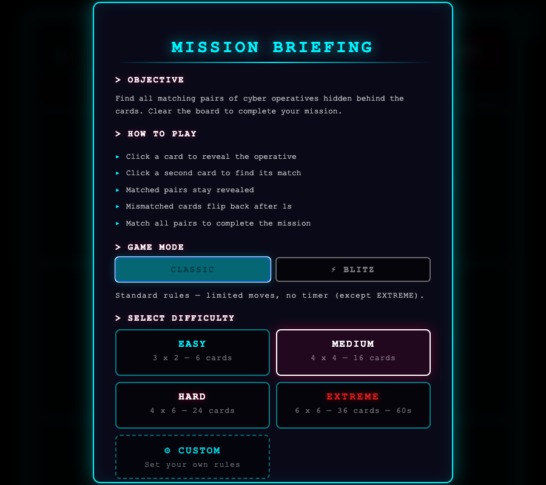
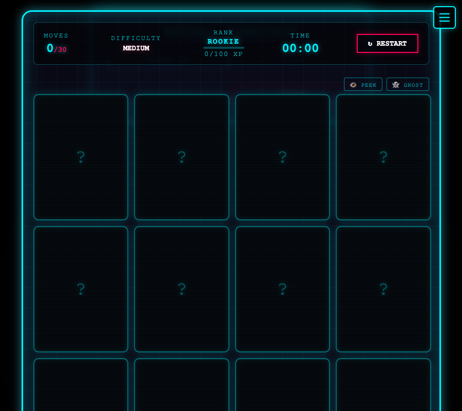
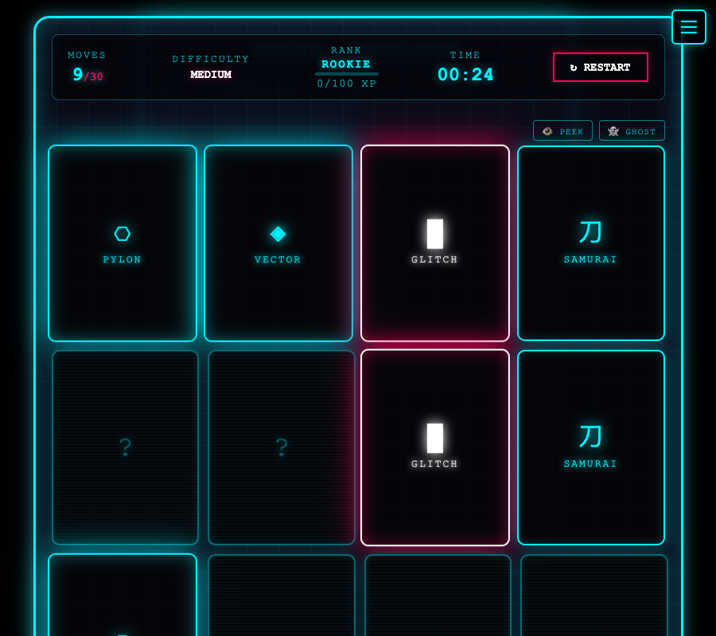
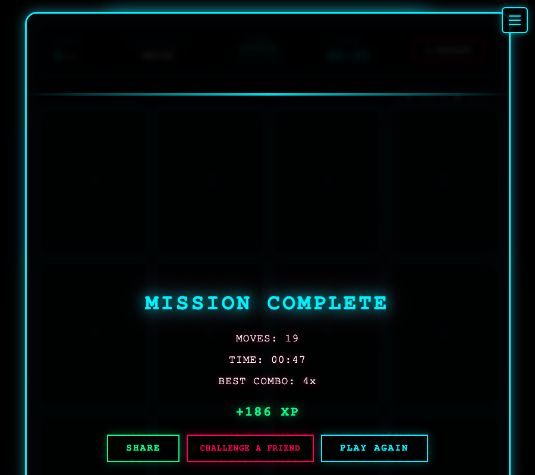

# BreachOS

A cyberpunk-themed memory card game built with vanilla HTML, CSS, and JavaScript. Match pairs of sci-fi operatives across multiple game modes, earn XP, unlock ranks, collect card skins, and sync your progress across all devices.

**[Play Now →](https://breachos.laddtnov.xyz/)**

<a href="https://play.google.com/store/apps/details?id=xyz.laddtnov.breachos">
  
</a>

---

## Tech Stack


[](https://buymeacoffee.com/laddtnov)

- **Frontend** — Vanilla HTML5/CSS3/JS, zero frameworks, zero bundler
- **Backend** — Vercel serverless functions (Node.js)
- **Database** — Supabase (Postgres + Auth)
- **Email** — Resend API
- **PWA** — Service worker, offline support, installable

---

## Screenshots

| Mission Briefing | Game Board |
|:---:|:---:|
|  |  |

| Gameplay | Mission Complete |
|:---:|:---:|
|  |  |

---

## Game Modes

| Mode | Description |
|------|-------------|
| **Classic** | Standard rules — limited moves, no timer (except Extreme) |
| **Blitz** | Race the clock — every difficulty has a countdown, no move limits |
| **Survival** | Endless escalating waves with 3 lives |
| **Daily Challenge** | Seeded daily puzzle — same cards for everyone, tracks streaks |

---

## Features

### Core Gameplay
- **4 Difficulty Levels** — Easy (3×2), Medium (4×4), Hard (4×6), Extreme (6×6)
- **28 Cyber Operatives** to match
- **Combo System** — chain consecutive matches for bonus XP
- **Move + Time Limits** — strategic pressure per mode and difficulty
- **Extreme Combo Time Bonus** — each consecutive match in Extreme adds +10 seconds to the countdown

### Progression
- **5 Ranks** — ROOKIE → AGENT → SPECIALIST → GHOST → NETRUNNER ELITE
- **XP Calculation** — difficulty × move efficiency × speed × combo chains
- **10 Card Skins** — Default, Hologram, Corrupted, Gold Circuit, Elite Neon, Survivor, Chrono, Plasma Burn, Acid Rain, Shadow Protocol
- **16 Collection Cards** — unlocked by rank, survival waves, daily streaks, win milestones, blitz wins and more
- **16 Achievements** — spanning gameplay, speed, combos, survival, daily challenges and hidden secrets

### Unlock Conditions

| Reward | How to Unlock |
|--------|---------------|
| Hologram skin | Reach AGENT rank |
| Corrupted skin | Reach SPECIALIST rank |
| Gold Circuit skin | Reach GHOST rank |
| Elite Neon skin | Reach NETRUNNER ELITE rank |
| Survivor skin | Survive wave 5 |
| Chrono skin | 7-day daily streak |
| Plasma Burn skin | Win 20 games |
| Acid Rain skin | Reach 7× combo |
| Shadow Protocol skin | Play 100 games |
| PHOENIX card | Survive wave 10 |
| ORACLE PRIME card | 30-day daily streak |
| TEMPEST card | Win 20 games |
| ARCHITECT card | 200 total matches |
| OVERCLOCKED card | 7× combo |
| ENTROPY card | Survive wave 15 |
| PHANTOM card | Play 50 games |
| WRAITH card | Survive wave 20 |
| CIPHER card | 14-day daily streak |
| CATALYST card | Win 10 blitz games |
| ECLIPSE card | Win 50 games |

### Audio & Visuals
- **11 Sound Themes** — Cyber, Retro 8-Bit, Synthwave, Glitch, Minimal, Horror, Jazz Runner, Rave Core, Ambient Void, Arcade, Neon Bass
- **13 Table Themes** — Cyber, Blood Circuit, Matrix, Solar Flare, Void, Ice Cold, Toxic Waste, Ember Core, Midnight, Sakura, Storm Surge, High Contrast, Daylight
- **Particle effects**, scanline animations, glitch overlays, rank-up cinematic

### Cross-Device Sync
- **Account system** — register / log in via the SYNC button
- **Auto-sync** — progress pushes to Supabase on every game save
- **Merge strategy** — always takes the highest value across devices
- **Welcome email** — cyberpunk greeting sent on signup via Resend
- **Re-engagement email** — "SIGNAL LOST" email sent after 14 days of inactivity

### Daily Quests
- **3 rotating objectives per day** — win games, hit combos, clear difficulties, perfect wins, survival waves
- **Seeded** — all players share the same quests each day
- **Bonus XP** on completion, resets at midnight

### Quality of Life
- **Player Dossier** — full stats dashboard with game history (last 10 games)
- **Share Card** — Canvas-generated result image
- **Cyber / Safe Mode** — toggle animations for accessibility
- **Color Blind Mode** — blue/orange palette replaces cyan/pink; dashed border as shape cue; persists across sessions
- **Respects `prefers-reduced-motion`**
- **Mobile-first** — hamburger menu, responsive grid layouts
- **DAYLIGHT theme** — light mode for outdoor / bright-sunlight play on mobile
- **HIGH CONTRAST theme** — white/black/yellow palette for low-vision players (WCAG 1.4.3)
- **PWA** — installable, works offline
- **Konami Code** — hidden easter egg with achievement

---

## Project Structure

```
breachos/
├── index.html              # Single-page app shell
├── manifest.json           # PWA manifest
├── sw.js                   # Service worker (network-first, breachos-v44)
├── vercel.json             # Cron schedule + security headers
├── css/                    # Modular stylesheets
├── js/                     # Game logic (vanilla ES6+)
│   ├── auth.js             # Auth state, sync, panel navigation
│   ├── game.js             # Core game loop
│   ├── rank.js             # XP, ranks, saveStats
│   ├── achievements.js     # 16 achievements
│   ├── collections.js      # 16 collection cards
│   ├── survival.js         # Survival mode
│   ├── daily.js            # Daily challenge + streaks
│   ├── quests.js           # Daily quests
│   └── ...
├── api/
│   ├── auth/
│   │   ├── register.js     # Create account + welcome email
│   │   ├── login.js        # Authenticate + return JWT
│   │   ├── forgot-password.js
│   │   └── reset-password.js
│   ├── sync/
│   │   ├── save.js         # Push playerStats to Supabase
│   │   └── load.js         # Pull + merge from Supabase
│   ├── cron/
│   │   └── re-engage.js    # Daily re-engagement email job
│   └── leaderboard/
│       ├── get.js          # Fetch leaderboard entries
│       └── daily.js        # Daily challenge leaderboard
├── lib/
│   ├── db.js               # Supabase clients (admin + public)
│   ├── ratelimit.js        # In-memory sliding window rate limiter
│   └── emails.js           # Shared HTML email templates
├── partials/               # HTML fragments loaded at runtime
└── supabase-*.sql          # Database schema + migrations
```

---

## How to Play

1. Open [breachos.laddtnov.xyz](https://breachos.laddtnov.xyz/)
2. Select a mode and difficulty from the briefing screen
3. Flip cards to find matching pairs
4. Chain matches for combo bonuses
5. Earn XP, rank up, unlock skins and collection cards
6. Hit **SYNC** to register and keep your progress across all devices

---

## Run Locally

```bash
git clone https://github.com/laddtnov/breachos.git
cd breachos
npm install
python3 -m http.server 8080
```

Open `http://localhost:8080`. Note: API routes require Vercel dev or environment variables to function.

---

## Roadmap

See [`ROADMAP.md`](ROADMAP.md) for planned features.

---

## Changelog

### v1.4.5
- **New:** Delete account flow — Profile → Delete Account permanently removes all data from Supabase Auth and the profiles table immediately; GDPR compliant
- **Fix:** Privacy policy updated to reflect immediate deletion (was "within 30 days")

### v1.4.4
- **Fix:** `privacy.html` added to service worker cache — privacy policy now available offline
- **SEO:** `sitemap.xml` added with root and `/privacy` URLs; referenced in `robots.txt`
- **Chore:** Service worker cache bumped to `breachos-v47`

### v1.4.3
- **Play Store:** `/.well-known/assetlinks.json` added for TWA domain verification (package `xyz.laddtnov.breachos`)
- **Play Store:** Google Play badge added to README
- **Chore:** Service worker cache bumped to `breachos-v45`

### v1.4.2
- **New:** Privacy Policy page (`/privacy`) — covers data collected, third-party services (Supabase, Resend, Vercel), retention, user rights, COPPA, and contact; required for Google Play Store submission
- **PWA:** Maskable icon declared in manifest — enables Android adaptive icon support
- **PWA:** Screenshots added to manifest (4 game scenes) — required for Play Store install sheet
- **PWA:** HTTP → HTTPS redirect via Vercel config; `robots.txt` added; `<meta description>` and canonical URL in index
- **Chore:** Service worker cache bumped to v44

### v1.4.1
- **Fix:** `blitzWins` and `perfectWins` missing from default stats — fresh-install players could get NaN propagating into saves and sync
- **Fix:** Expired auth token mid-session now reverts the SYNC button instead of silently losing stat updates
- **Fix:** Network failure on sync load no longer produces an unhandled promise rejection in the console
- **Security:** HSTS, CSP, X-Frame-Options, X-Content-Type-Options, Referrer-Policy, and Permissions-Policy headers added to all responses
- **Security:** Rate limiting on auth endpoints — login (10/15 min), register (5/hour), forgot-password (3/hour) per IP
- **Security:** Username character allowlist on registration prevents HTML injection in transactional emails
- **Security:** Leaderboard routes now use the anon (publishable) key instead of the service role key

### v1.4.0
- **New:** Daily Quests — 3 rotating objectives per day (win games, hit combos, clear difficulties, perfect wins, survival waves); bonus XP on completion, resets at midnight, seeded so all players share the same quests
- **New:** Extreme Combo Time Bonus — each consecutive match in Extreme difficulty adds +10 seconds to the countdown timer
- **New:** Color Blind Mode — replaces cyan/pink card palette with blue/orange; orange group uses a dashed border as an additional shape cue; persists across sessions
- **New:** Game History — last 10 games shown in Dossier (mode, difficulty, time, moves, combo, XP)

### v1.3.0
- **New:** SUPPORT button in desktop controls and mobile menu — opens Buy Me a Coffee in a new tab

### v1.2.1
- **Fix:** Desktop control buttons lost neon styling after donation UI removal (trailing comma in CSS selector)

### v1.2.0
- **New:** Buy Me a Coffee support link in README
- **Removed:** In-game donation UI (DONATE button, modal, all related CSS/JS)
- **Chore:** CI — Claude Code security review workflow
- **Chore:** Dependency bumps (brace-expansion, resend)

### v1.1.0
- **New:** DAYLIGHT theme — light mode for outdoor mobile readability
- **Fix:** Game board was empty on first load (cards required a manual click to appear)
- **Fix:** Service worker switched to network-first to prevent stale asset caching after deploys
- **Fix:** Service worker cache renamed from `cybermatch` to `breachos`
- **Fix:** `.cyber-table` horizontal overflow on mobile (added `box-sizing: border-box`)
- **Fix:** Default table border glow appeared pink instead of cyan
- **Fix:** BLOOD CIRCUIT theme glow intensity toned down
- **Fix:** Win/Lose overlay text invisible in DAYLIGHT and HIGH CONTRAST themes
- **Fix:** SVG favicon added for browser tabs and PWA

### v1.0.0
- Initial public launch

---

## License

MIT
